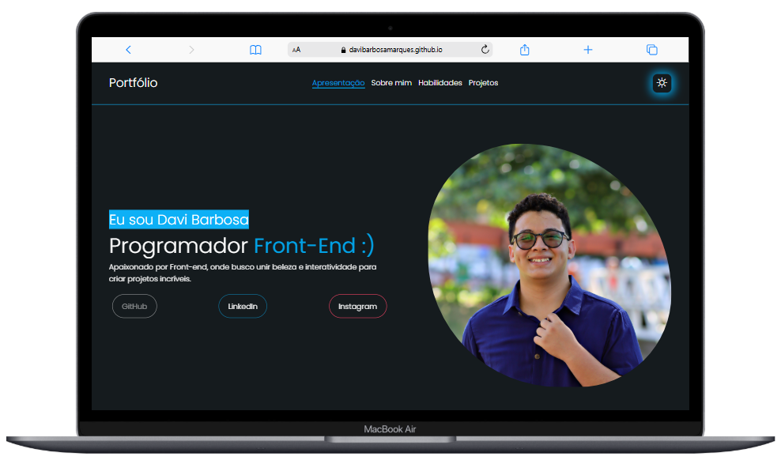
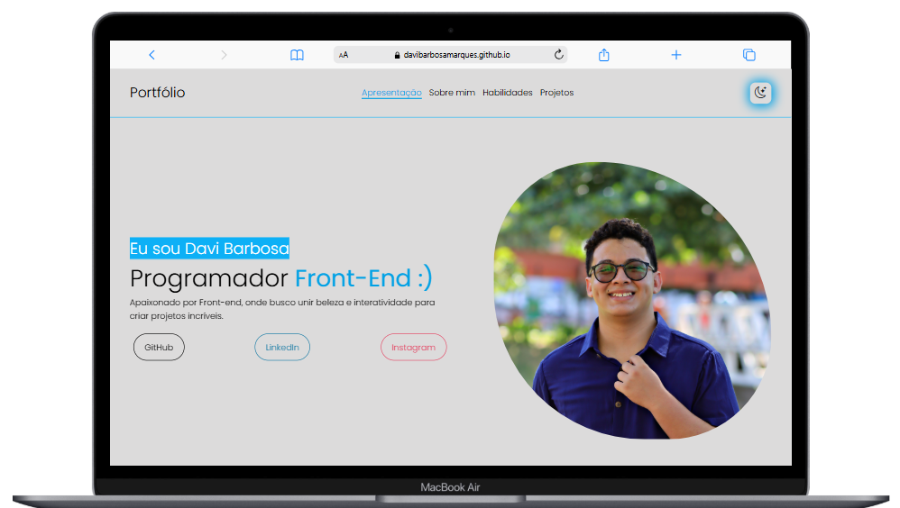
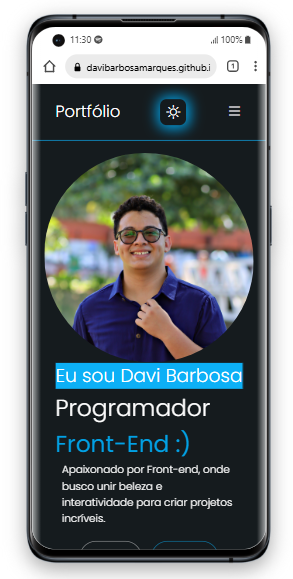

# Meu Portfólio
<a href="https://davibarbosamarques.github.io/Portfolio/" target="_blank">
    🔗 <strong>Visite o portfólio aqui</strong>
</a>

Este é o meu portfólio pessoal, onde apresento alguns dos projetos que desenvolvi, além de informações sobre mim e minhas habilidades como desenvolvedor web.

## 🌐 Visão Geral

Abaixo você pode ver como o site se comporta em diferentes temas e tamanhos de tela:

### 🌙 Tema Escuro

### 💡 Tema Claro

### 📱 Versão Mobile

## 🛠 Tecnologias Utilizadas

O projeto foi desenvolvido utilizando as seguintes tecnologias:

  
  
  

- **HTML5** para estruturação da página
- **CSS3** para o estilo, incluindo suporte a tema claro/escuro
- **JavaScript** para interatividade e responsividade
